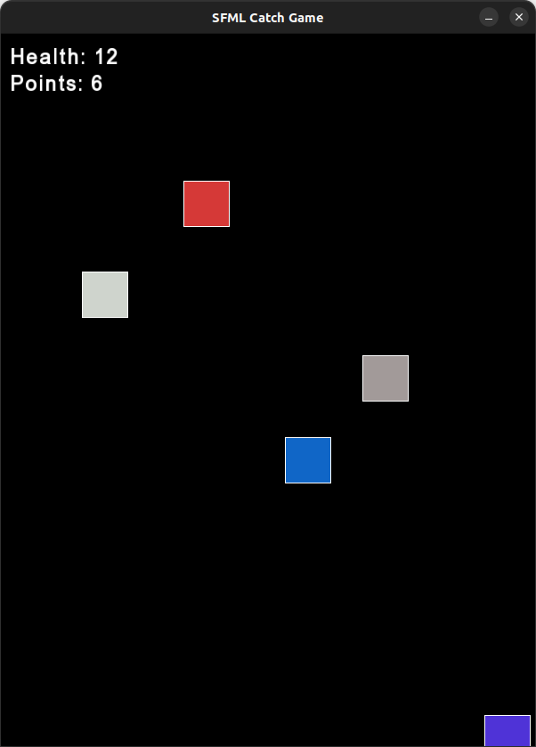

<h1> 🕹️ Catch-game </h1>
<h4> Simple game made in cpp </h4>

<ul><li><h2>✨ Features:</h2></li></ul>

 ✔️ Mouse events traitment 

 ✔️ Square texture with Vector2<T> 

 ✔️ Random positions and colors in squares 

 ✔️ Dificulty levels 

 ✔️ Basic scoring system 

